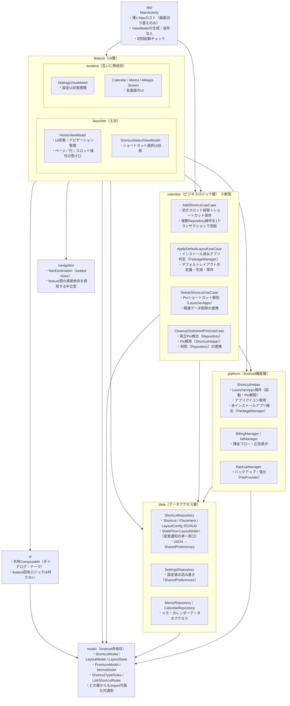

# ターゲットアーキテクチャ図

作成: 2026-06-03

## モジュール依存図

依存は常に下向き。

---

## 各層の責務

### model/
Android SDK に依存しない純粋な Kotlin のデータクラス・ドメインロジック。
どの層からも import できる共通の型定義。最下層として Android 環境への依存を持たない。

### navigation/
画面遷移先の型定義（`NavDestination` sealed class）。
feature 同士が直接依存せず、「どこへ行くか」を宣言するだけで済むよう中立的な共有型として独立させる。

### data/
SharedPreferences / ContentProvider によるデータ永続化・アクセスを担う `*Repository` クラス。
**CRUD と StateFlow の提供のみ**を行う。ビジネスロジックは持たない。
`ShortcutRepository` は `StateFlow<LayoutState>` を保持し、複数の ViewModel に対してレイアウト状態の単一の真実を提供する。

### platform/
Android SDK（`LauncherApps` / `PackageManager` / `FileProvider` / `BillingClient` 等）を直接扱うクラス。
`*Manager` / `*Helper` などの命名が目安。
「Android 機能の配管」を担い、ビジネスロジックは持たない。

### usecase/
**data と platform をまたぐビジネスロジック・オーケストレーションを担う層。**
複数の Repository 操作をまとめる、PackageManager と Repository を組み合わせる、といった処理をここに集約する。
feature と data/platform の間の緩衝材として、feature がデータ層・Android層の詳細を知らなくて済むようにする。

### feature/
ViewModel と Screen（Composable）のペア。
**ViewModel は UI 状態の管理に専念する**。ビジネスロジックは UseCase に委譲し、Android SDK は直接呼ばない。
feature 間の相互依存は禁止。画面遷移は `NavDestination` を宣言するだけ。

### ui/
feature をまたいで使う共有 Composable コンポーネントとテーマ定義。
feature 固有の UI ロジックはここに置かず、汎用部品のみを管理する。

### app（MainActivity）
nav-host として画面の差し替えを機械的に行うだけの薄い層。
ViewModel の生成と依存注入もここで行う。
