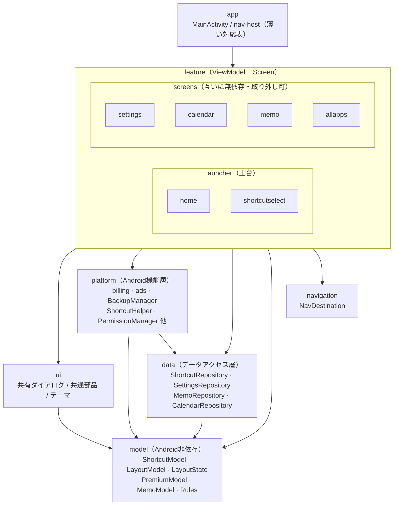

# パッケージ構成

作成: 2026-06-03

## モジュール依存図

依存は常に下向き。

---

## 各パッケージの意図

### model/
Android SDK に依存しない純粋な Kotlin のデータクラス・ドメインロジックを置く。
どの層からも import できる共通の型定義。
依存の方向を一方向に保つため、最下層として Android 環境への依存を持たない。

- `ShortcutModel` — ショートカットの型定義（`ShortcutType` / `ShortcutItem`）
- `LayoutModel` — グリッド配置の型定義（`RowConfig` / `HomeLayoutConfig` / `ShortcutPlacement`）
- `LayoutState` — レイアウト全体のスナップショット。`ShortcutRepository` が `StateFlow` として公開し複数の ViewModel が購読する
- `PremiumModel` — プレミアム状態の型定義（`PremiumSource` / `PremiumStatus`）
- `MemoModel` — メモ機能のデータ型
- `ShortcutTypeRules` / `LinkShortcutRules` — ショートカット種別の判定ロジック（削除可否・Link系判定等）

### navigation/
画面遷移先の型定義（`NavDestination` sealed class）。
feature 同士が直接依存せず、「どこへ行くか」を宣言するだけで済むよう中立的な共有型として独立させる。
Navigation-Compose は使わず、`MainActivity` の薄い対応表が画面の差し替えを担う。

### data/
SharedPreferences / ContentProvider によるデータ永続化・アクセスを担う `*Repository` クラスを置く。
命名規則として Repository のみをこの層に集約する。
`ShortcutRepository` は `StateFlow<LayoutState>` を保持し、複数の ViewModel に対してレイアウト状態の単一の真実を提供する。

### platform/
Android SDK（`LauncherApps` / `PackageManager` / `FileProvider` / `BillingClient` 等）を直接扱うクラスを置く。
`*Manager` / `*Helper` / `*Activity` などの命名が目安。
`data/` の Repository とは「Android 機能の配管」vs「データの永続化」で役割を分ける。

### feature/
ViewModel と Screen（Composable）のペアを機能単位で置く。
**feature 間の相互依存は禁止**。画面遷移は `NavDestination` を宣言するだけ。
- `launcher/` — ランチャーの土台。`home` が起点、`shortcutselect` が編集フロー
- `screens/` — home から開く独立した遷移先。互いに無依存で取り外し可能

### ui/
feature をまたいで使う共有 Composable コンポーネントとテーマ定義を置く。
feature 固有の UI ロジックはここに置かず、汎用部品のみを管理する。

### app（MainActivity）
nav-host として画面の差し替えを機械的に行うだけの薄い層。
判断（行き先の宣言）は feature 側、機構（差し替え）は app が担う。
ViewModel の生成と依存注入もここで行う。
