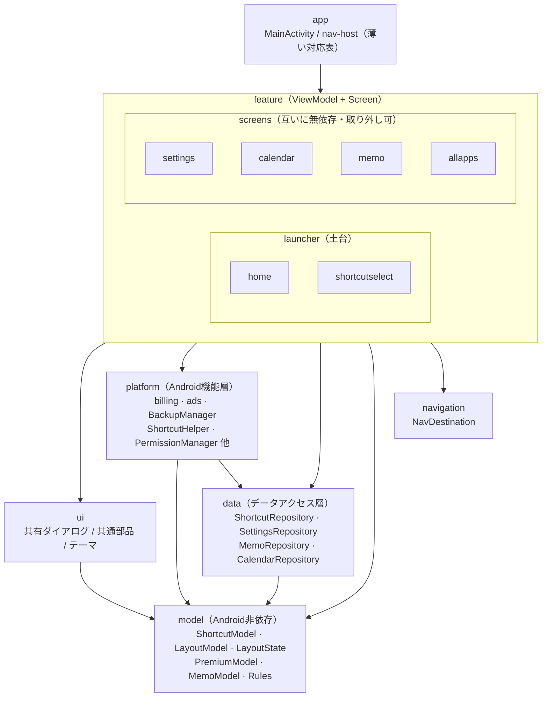

# パッケージ構成

作成: 2026-06-03

## モジュール依存図

依存は常に下向き。

```mermaid
graph TD
    app["app<br/>MainActivity / nav-host（薄い対応表）"]

    subgraph feature["feature（ViewModel + Screen）"]
        subgraph launcher["launcher（土台）"]
            home[home]
            shortcutselect[shortcutselect]
        end
        subgraph screens["screens（互いに無依存・取り外し可）"]
            settings[settings]
            calendar[calendar]
            memo[memo]
            allapps[allapps]
        end
    end

    ui["ui<br/>共有ダイアログ / 共通部品 / テーマ"]
    platform["platform（Android機能層）<br/>billing · ads · BackupManager<br/>ShortcutHelper · PermissionManager 他"]
    data["data（データアクセス層）<br/>ShortcutRepository · SettingsRepository<br/>MemoRepository · CalendarRepository"]
    model["model（Android非依存）<br/>ShortcutModel · LayoutModel · LayoutState<br/>PremiumModel · MemoModel · Rules"]
    navigation["navigation<br/>NavDestination"]

    app --> feature
    feature --> ui
    feature --> platform
    feature --> data
    feature --> model
    feature --> navigation
    ui --> model
    data --> model
    platform --> model
    platform --> data
```
