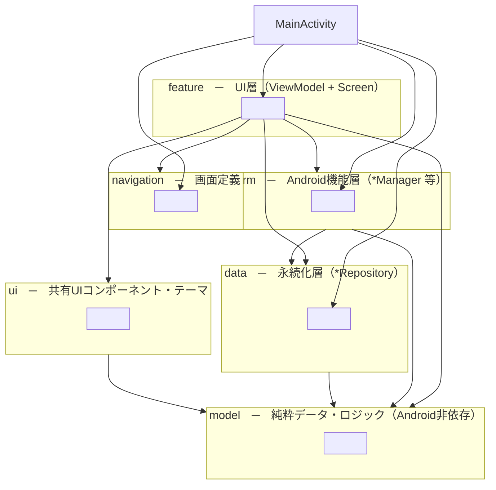
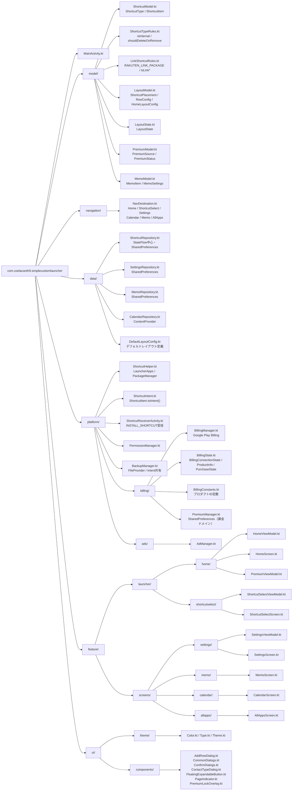

# パッケージ構成

## レイヤー依存関係

## ファイル一覧

## レイヤー責務

| パッケージ | 責務 | Android依存 |
|---|---|---|
| `model/` | 純粋データクラス・ドメインロジック | なし |
| `navigation/` | 画面遷移先の定義 | なし |
| `data/` | データ永続化（`*Repository`） | SharedPreferences / ContentProvider |
| `platform/` | Android機能ラッパー（`*Manager` 等） | あり |
| `feature/` | ViewModel + Screen（UI層） | Compose / ViewModel |
| `ui/` | 共有コンポーネント・テーマ | Compose |

## 依存方向ルール

- `model/` はどこにも依存しない
- `data/` は `model/` のみに依存
- `platform/` は `model/` と `data/` に依存
- `feature/` は `model/` `navigation/` `data/` `platform/` `ui/` に依存
- `feature/` 間の相互依存は禁止
