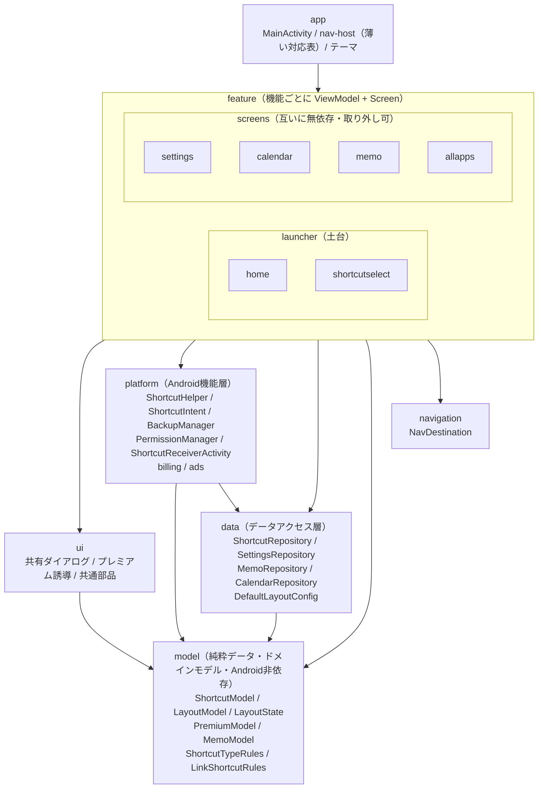

# 現行パッケージ構成図

作成: 2026-06-03

> 目標アーキテクチャ図との対比。リファクタリング実装後の現状を記録する。

---

## モジュール依存図

---

## 目標アーキテクチャ図との差分

| 目標 | 現行 | 備考 |
|---|---|---|
| `core/` | `model/` + `navigation/` | `core` を廃止。純粋データは `model/`、画面定義は `navigation/` に分離 |
| `core/layout` | `model/` に統合 | `ShortcutPlacement` `RowConfig` `HomeLayoutConfig` `LayoutState` |
| `core/shortcut` | `model/` に統合 | `ShortcutItem` `ShortcutType` `ShortcutTypeRules` `LinkShortcutRules` |
| `core/premium` | `model/PremiumModel.kt` | `PremiumSource` `PremiumStatus` のみ。`PremiumPolicy` は未実装（過剰と判断） |
| `core/navigation` | `navigation/` | パッケージを `core` から独立 |
| `PlacementOps`（純粋関数群） | 未実装 | `ShortcutSelectViewModel` に直接記述。過剰設計と判断 |
| `data/` にバックアップ | `platform/BackupManager` | FileProvider / Intent 依存のため `platform/` が正しい置き場 |
| `platform/CalendarRepository` | `data/CalendarRepository` | Repository の命名規則に従い `data/` へ統一 |
