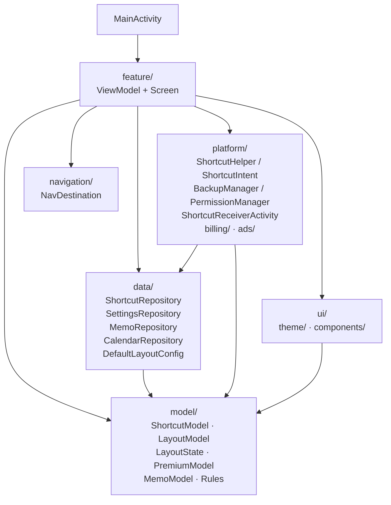

# パッケージ構成

```mermaid
flowchart TD
    APP["MainActivity"]

    APP --> FEATURE

    FEATURE["feature/\nViewModel + Screen"]

    FEATURE --> DATA
    FEATURE --> PLATFORM
    FEATURE --> UI
    FEATURE --> MODEL
    FEATURE --> NAV

    DATA["data/\nShortcutRepository\nSettingsRepository\nMemoRepository\nCalendarRepository\nDefaultLayoutConfig"]

    PLATFORM["platform/\nShortcutHelper / ShortcutIntent\nBackupManager / PermissionManager\nShortcutReceiverActivity\nbilling/ · ads/"]

    UI["ui/\ntheme/ · components/"]

    NAV["navigation/\nNavDestination"]

    DATA --> MODEL
    PLATFORM --> MODEL
    PLATFORM --> DATA
    UI --> MODEL

    MODEL["model/\nShortcutModel · LayoutModel\nLayoutState · PremiumModel\nMemoModel · Rules"]
```
