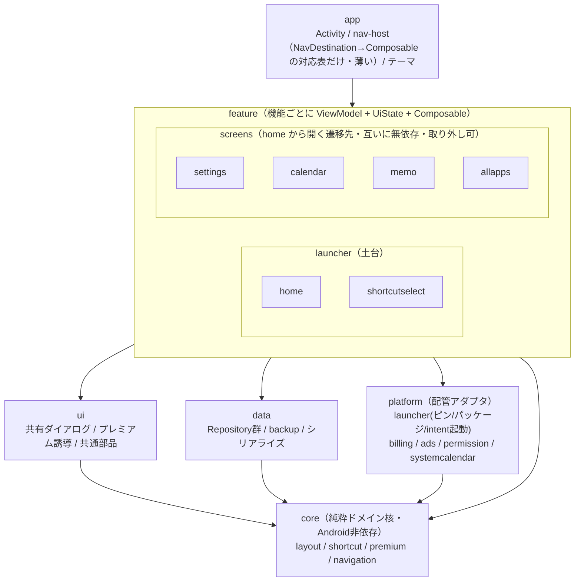
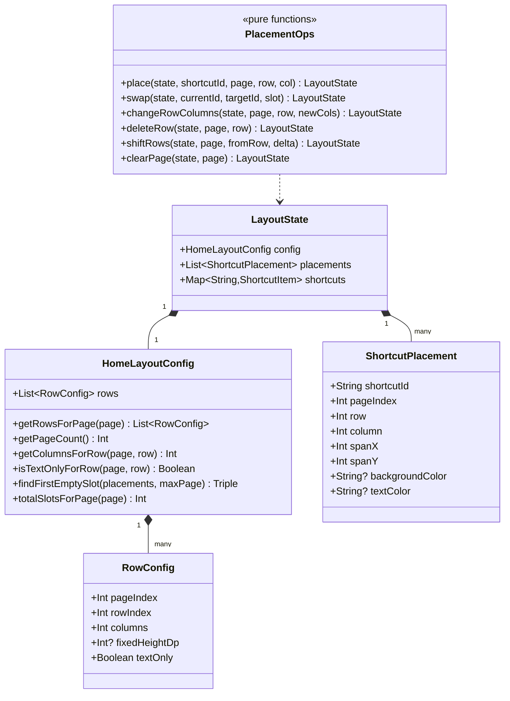
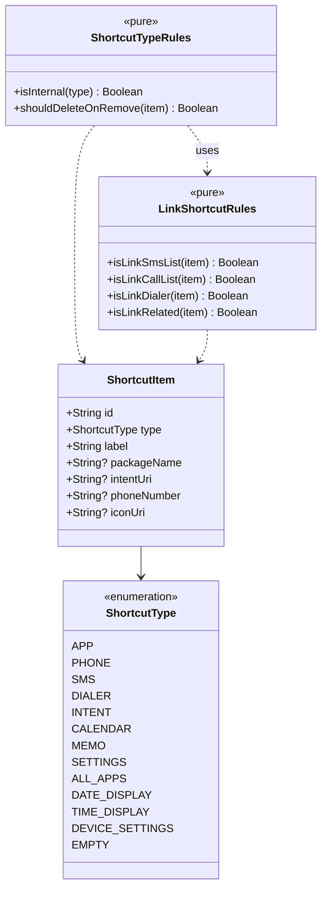
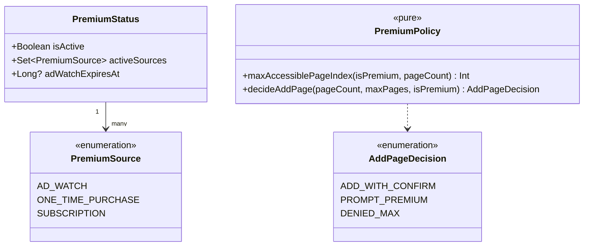
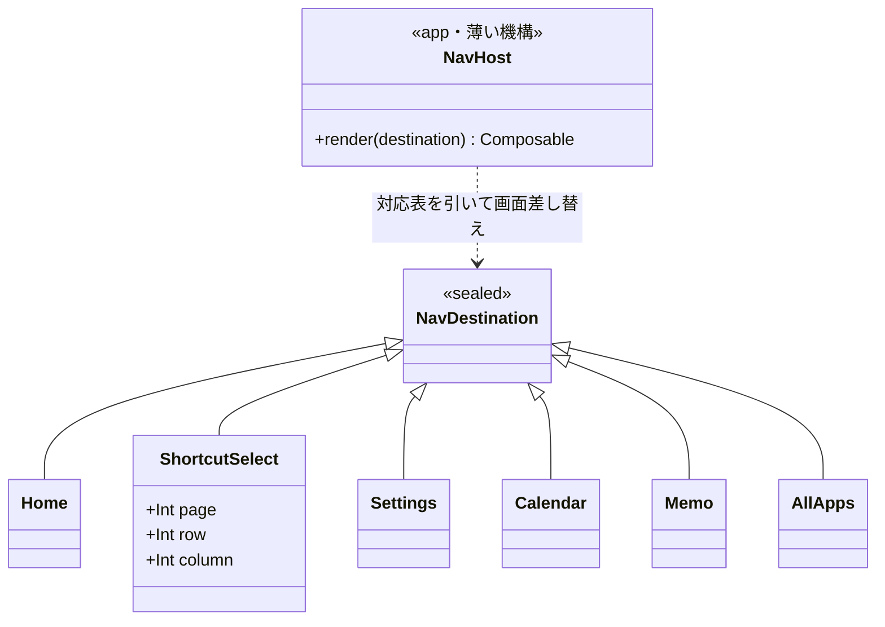

# 目標アーキテクチャ図

作成: 2026-06-01 

> これは目標設計（提案）の図であり、現コードの逆生成ではない。

---

## 1. モジュール依存図

依存は常に下向き（内側＝純粋）。**機能(feature)どうしは依存せず、共有する業務ルールは core に集約**する。

ポイント:
- 矢印は全て下向き・交差なし
- **feature は二階層**: `launcher`（home＋その編集フロー shortcutselect＝ランチャーの土台）と `screens`（home から開く独立した遷移先）。home は土台、memo/settings/calendar/allapps はその上に乗る遷移先で、階層が違う。
- `screens` 配下は互いに無依存。`settings` だけ必須・他3つは取り外し可だが、これは製品ラベルの差で**構造的にはどれも同じ「遷移先画面」**。
- **`feature → feature` の矢印は存在しない**。home は screens を直接起動せず `NavDestination`（行き先）を宣言するだけ。shortcutselect への遷移・結果返却も同様に契約経由なので、home → shortcutselect の直接依存も無い。
- ナビゲーションの「契約（`NavDestination`）」は core/navigation に置く中立の共有物。「判断（行き先の宣言）」は feature、「機構（画面の差し替え）」は app の nav-host が機械的に担うだけ＝**app は太らない**。Navigation-Compose は使わない（遷移が浅いスター型・独自HOME挙動と競合・ディープリンク不要のため）。
- 祝日ルールのように **1機能しか使わないドメインは core に上げず feature/calendar 内に閉じる**（共有されるものだけ core）。

---

## 2. core/layout — グリッド/配置ドメイン

`(HomeLayoutConfig, placements, shortcuts)` を状態とし、操作は「次の状態を計算する」純粋関数。永続化(I/O)は data 層が担当。

> **設計メモ（2026-06-02）**: LayoutState に `shortcuts: Map<String, ShortcutItem>` を含める（当初案は config+placements のみ）。理由：placements と shortcuts は常にセットで参照されるため分離すると ViewModel 側で再結合が必要になる。LayoutState が core/layout にあっても core/shortcut の ShortcutItem を参照することは依存方向として問題ない（どちらも core 内）。

注: `changeRowColumns` の「3列化でLink系を削除」「列削減ではみ出しを削除」といった業務ルールは `PlacementOps` 内で `core/shortcut` の判定を使う（下記参照）。

---

## 3. core/shortcut — ショートカット種別ドメイン

`ShortcutType` を分岐の中心に据え、起動可否・削除可否・Link判定を「種別の属性/ルール」として集約（現状は各所の `when` に散在）。

注:
- `ShortcutItem.toIntent()`（現状 ShortcutModel.kt:41）は Intent/Uri 依存の**配管なので core から除外し platform/launcher へ移す**。
- 楽天Linkのパッケージ名は定数化。インストール判定/アイコン取得は PackageManager 依存なので platform 側。

---

## 4. core/premium — プレミアム・ポリシー

「判定ルール（純粋）」と「SDK配管（Billing/Ads）」を分離。`PremiumStatus` は data/platform が prefs と時刻から組み立て、純粋な `PremiumPolicy` は出来上がった状態を受けてゲートを判定する。

注:
- `maxAccessiblePageIndex` は現状 `PremiumManager.getMaxAccessiblePageIndex()` と `MainViewModel.getAccessiblePageCount()` の**2箇所に重複**しているルール。これを `PremiumPolicy` に一元化する。
- `decideAddPage` は現状 `MainViewModel.handleRowLimitExceeded()`(:598) の純粋な判定部分を `AddPageDecision` として取り出したもの。
- 広告視聴の有効期限判定（`adWatchExpiresAt > now`）は**時刻依存なので純粋ではない**。現在時刻は外から注入し、PremiumStatus 組み立て側（data/platform）で評価する。

---

## 5. core/navigation — ナビゲーションの契約

「行き先の型（契約・データ）」を core に置き、feature は「どこへ行きたいか」を宣言するだけ。実際の画面差し替え（機構）は app の nav-host が対応表を引いて行う。Navigation-Compose は使わず、この薄い自前ディスパッチャで済ませる。

注:
- `NavDestination` は core/navigation の中立な sealed 型。全 feature が下向きに依存し、feature 同士は依存しない。
- 引数つき遷移（例 `ShortcutSelect(page,row,column)`）は文字列ルートでなく**実型のプロパティ**で持つ。これは「行き」だけを運ぶ。
- **「帰り」（選択結果）は値を返さず、共有状態経由で反映する**。shortcutselect は選択時に配置データ（LayoutState）を更新するだけ、home はそれを監視して再描画する。NavDestination にコールバックを持たせない（純粋データを維持・復元に強い）。
- 共有状態は **data 層のリポジトリが `StateFlow<LayoutState>` として1つ保持**し、home / shortcutselect 双方の ViewModel が同じものを購読する（ViewModel 共有はしない＝神ViewModel回避）。「配置＝唯一の真実」の置き場所をリポジトリに一元化する。
- 現状 `MainActivity` の巨大な `when(screenState)` と各種コールバックが、この `NavHost` の薄い対応表へ純化される。判断（行き先の宣言）は各 feature 側へ戻る。
- **`Settings`** は旧コードの `AppSettings` に相当。`SlotEdit` は設けない（新規配置も編集も `ShortcutSelect` に統合）。
