## こんな方におすすめ

- 小さなボタンが沢山あると混乱する方
- 大きなボタンで操作したい方
- 家族のスマホを見やすく設定してあげたい方

---

## 目次

- [基本の使い方](#基本の使い方)
  - [はじめに](#はじめに)
  - [ホーム画面](#ホーム画面)
  - [レイアウト編集モード](#レイアウト編集モード)
- [ショートカット](#ショートカット)
  - [ショートカットに設定できるもの](#ショートカットに設定できるもの)
  - [連絡先ショートカット](#連絡先ショートカット)
  - [楽天Link連携](#楽天link連携)
  - [端末設定ショートカット](#端末設定ショートカット)
  - [外部ショートカット](#外部ショートカット)
  - [アプリ一覧の呼び出し](#アプリ一覧の呼び出し)
  - [アイコンの表示/非表示の切り替え](#アイコンの表示非表示の切り替え)
  - [スロット背景と文字色の変更（プレミアム機能）](#スロット背景と文字色の変更プレミアム機能)
- [内蔵機能](#内蔵機能)
  - [カレンダー](#カレンダー)
  - [メモ帳](#メモ帳)
- [アプリ設定](#アプリ設定)
  - [ダークモード](#ダークモード)
  - [確認ダイアログ](#確認ダイアログ)
  - [振動の強さ](#振動の強さ)
  - [ページの追加（プレミアム機能）](#ページの追加プレミアム機能)
  - [バックアップ・復元（プレミアム機能）](#バックアップ復元プレミアム機能)
- [プレミアム機能](#プレミアム機能)
- [ダウンロード](#ダウンロード)
- [リンク](#リンク)

---

## 基本の使い方

### はじめに

設定画面の一番上のボタンから、Androidのデフォルトホームアプリの設定画面を開けます。

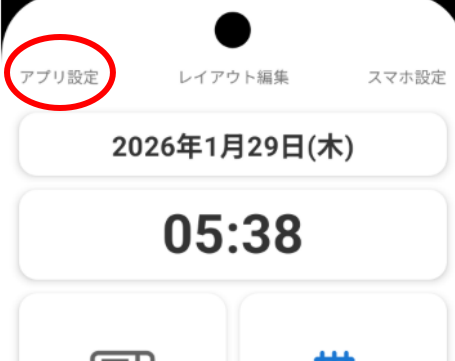

シンプルカスタムランチャーをデフォルトホームアプリに指定してください。

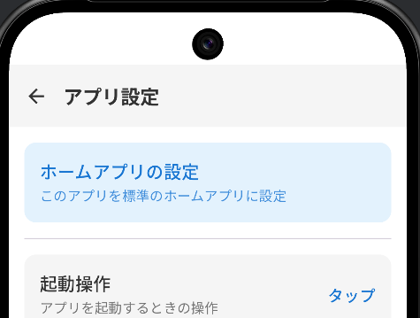

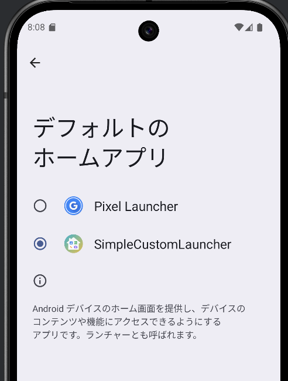

### ホーム画面

初期状態では代表的なプリインストールアプリやアプリ内部機能が配置されています。

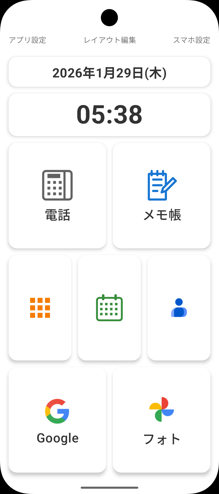

画面最上部の「アプリ設定」「レイアウト編集」「スマホ設定」は、設定にかかわらず常に表示されます。

- **アプリ設定**: このアプリの設定画面を開きます
- **スマホ設定**: 端末（スマホやタブレット）自体の設定画面を開きます
- **レイアウト編集**: レイアウト編集モードに移行します

### レイアウト編集モード

画面上部の「レイアウト編集」をタップすると編集モードに入ります。

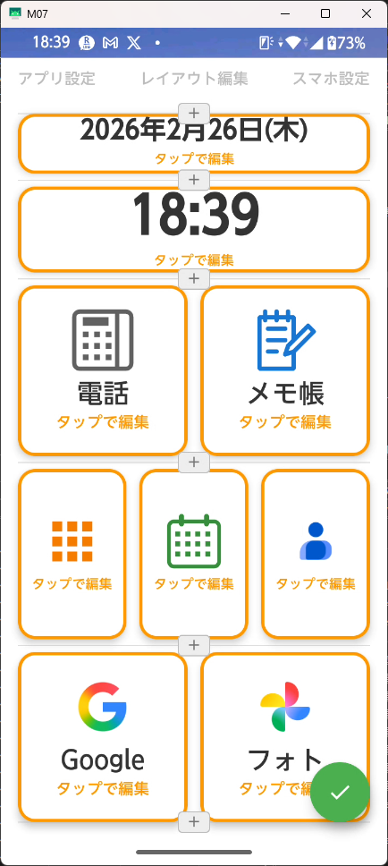

編集モードでは、アプリ配置用スロットが黄色い枠で囲われます。
画面右下にフローティングボタン（✅️）が表示されます。
- フローティングボタンをタップすると編集を完了します。
- 長押しすると、
  - 「レイアウトをクリア」
  - 「このページを削除」(２ページ以上ある時のみ表示) 
  というアクションが展開されます。
- 長押ししたまま実行したいアクションの方にスライドさせると、そのアクションが少し大きくアニメーションし、その状態で指を離すとそのアクションが実行されます。

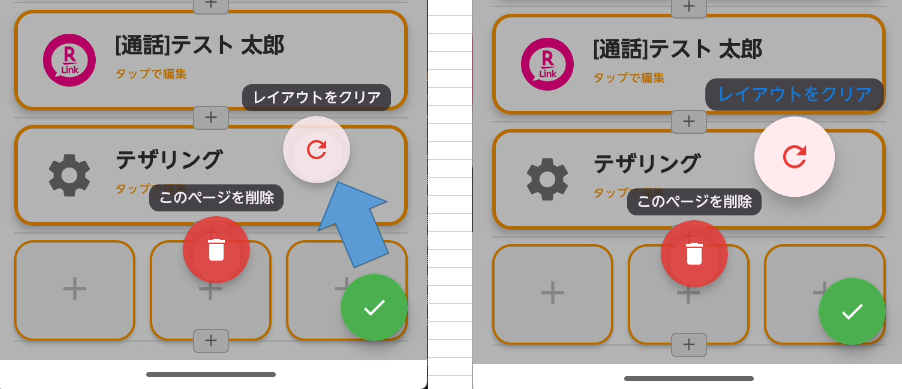

- **行追加**: 行と行の間に表示されている「＋」ボタンを押すと、その位置に新しい行ができます。
- **分割数の変更**: 各行は横に1〜3分割できます。枠をタップして分割数を選択します

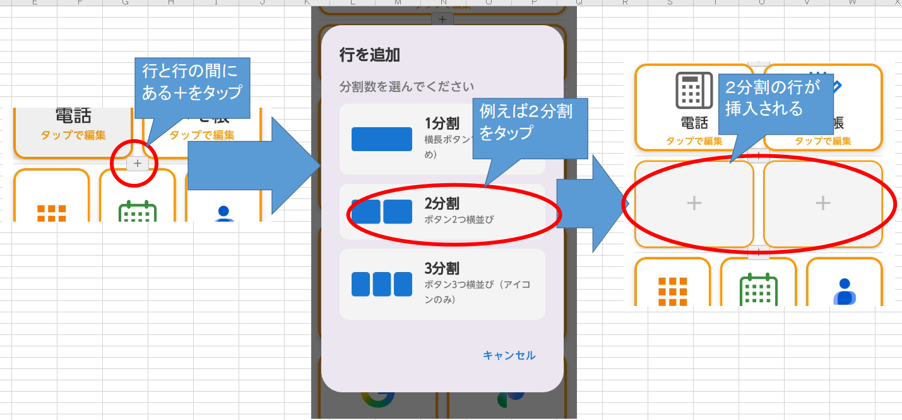

　行数が上限の時に更に行を追加しようとすると、ページを追加するためのプレミアム誘導のポップアップが表示されます。
　[ページ数設定の説明はこちら](#ページの追加プレミアム機能)

- **ショートカットの割り当て**: 空の枠をタップして、割り当てたいアプリや機能を選びます

---

## ショートカット

### ショートカットに設定できるもの

| 種類 | 説明 |
|------| ------|
| アプリ | インストール済みのアプリをショートカットとして割り当て |
| [通話](#連絡先ショートカット) | 宛先入力済みで発信画面を表示 |
| [SMS](#連絡先ショートカット) | 宛先とのメッセージ画面を表示 |
| [メモ帳](#メモ帳) | 内蔵メモ帳を開く |
| [アプリ一覧](#アプリ一覧の呼び出し) |　インストール済みアプリの一覧を表示（ホーム画面の上スワイプでも呼び出せます） |
| 日付表示 | 現在の日付をホーム画面に表示 |
| 時刻表示 | 現在の時刻をホーム画面に表示 |
| [端末設定](#端末設定ショートカット) | Wi-Fi・Bluetooth・テザリングなど端末の設定画面を直接開く |
| [楽天Link連携](#楽天link連携) | 楽天Linkでの通話・SMS・通話一覧・ダイアルパッドを呼び出し |
| [外部ショートカット](#外部ショートカット) | LINEなど他アプリが提供するショートカットにも対応 |

### 連絡先ショートカット

特定の相手への電話発信・SMS送信をワンタップで行えるショートカットを配置できます。

**設定手順：**
1. レイアウト編集モードに入ります
2. 配置したいスロットをタップし、「連絡先から追加」を選びます

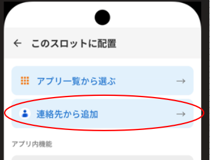

3. 連絡先の一覧から相手を選択します

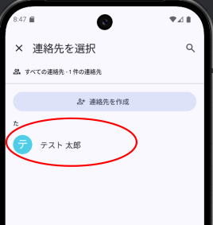

4. ダイアログで、電話かSMSかの選択を求められますので、希望する方を選択します。

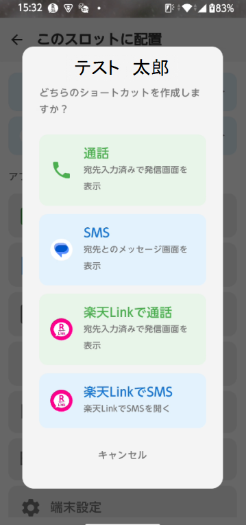

5. ショートカットが配置されます

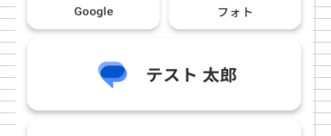

6.配置されたショートカットをタップすると発信・送信画面が開きます

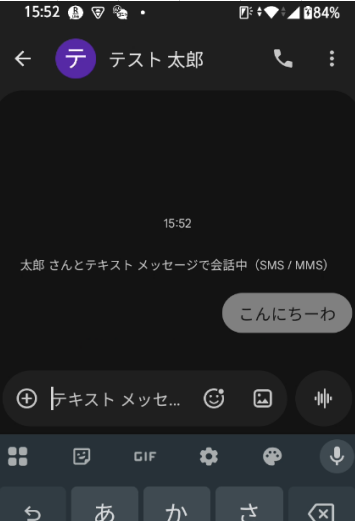

<iframe style="position: absolute; top: 0; left: 0; width: 100%; height: 100%;"
  src="https://www.youtube.com/embed/xU6-hmSIJyc"
  frameborder="0" allowfullscreen>
</iframe>

### 楽天Link連携

楽天Linkがインストールされている端末では、以下のショートカットを利用できます。

| 機能 | 説明 |
|------|------|
| 楽天Linkで通話 | 宛先入力済みで発信画面を表示 |
| 楽天LinkでSMS | 宛先とのメッセージ画面を表示 |
| Link通話一覧 | 楽天Linkの通話一覧を開く |
| LinkSMS一覧 | 楽天LinkのSMS一覧を開く |
| 電話（Link） | 楽天Linkのダイアルパッドを開く |

**設定手順：**
1. レイアウト編集モードに入り、スロットをタップします。3列構成では楽天Linkショートカットは配置できません。1列か2列構成の行で登録してください。
2. 「連絡先から追加」を選ぶと、通常の通話・SMSに加えて楽天Link経由の通話・SMSを選択できます
3. Link通話一覧・LinkSMS一覧・電話（Link）は、「アプリ内機能」セクションから追加できます

> **注意：**
> - **楽天Link連携機能は1列・2列のレイアウトでのみ利用可能です（3列ではラベルが表示されないため、全て同じアイコンだけが表示されることになり区別できないため、３列の行では楽天Link連携機能は選択肢として表示されません）**
> - 個別連絡先ショートカットにはラベルに `[通話]` `[SMS]` のプレフィックスが付き、同じ相手への通話とSMSを区別できます
> - 楽天LinkでSMSは、楽天Linkアプリ側で相手とのSMS履歴（相手から返信された事がある状態）が必要です

楽天LinkでSMSのショートカットを作りたい場合、あらかじめ「楽天Link」本体の方で、該当の連絡先とSMSを行い、相手から返信がもらえている履歴が「楽天Link」アプリに残っている必要があります。
履歴がない場合、このようなエラーとなります。

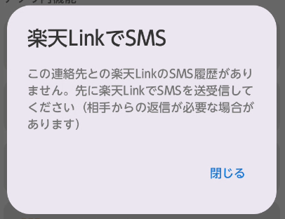

標準アプリと楽天Linkで通話とSMSをショートカットにしてみた画面

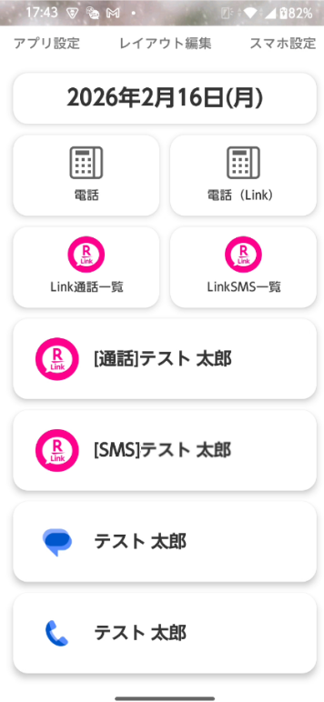

### 端末設定ショートカット

Wi-Fi・Bluetooth・テザリング・画面・音・位置情報・アプリ・バッテリー・機内モードなど、端末の設定画面をワンタップで開けるショートカットを配置できます。

**設定手順：**
1. レイアウト編集モードに入ります
2. 配置したいスロットをタップし、「端末設定」を選びます
3. 開きたい設定項目を選択します
※選択肢がやや多いため、ポップアップした選択肢のダイアログ内のリストを上下にスクロールしないと全部が見えない場合があります。

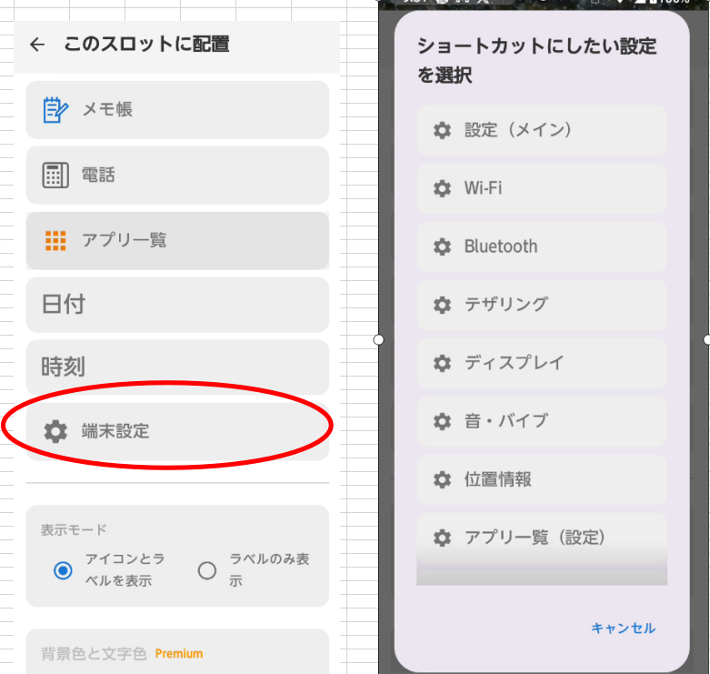

### 外部ショートカット

LINEなどのサードパーティ製アプリが提供するショートカットを配置できます。たとえばLINEの特定の相手とのトーク画面を開くショートカットなど、アプリ側が対応していればワンタップで呼び出せます。

**設定手順：**
1. **先に**シンプルカスタムランチャーをデフォルトのホームアプリに設定します
2. LINEなどのアプリ内で「ホーム画面にショートカットを追加」を実行します

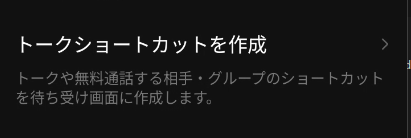

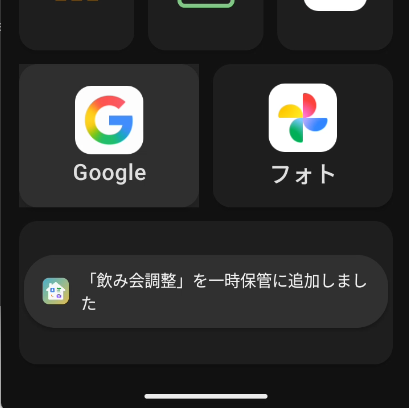

3. シンプルカスタムランチャーでレイアウト編集モードに入ります

4. 配置したいスロットをタップし、「一時保管」の中から追加したショートカットを選んで配置します

> **注意:** 必ずシンプルカスタムランチャーをホームアプリに設定してから、ショートカットを作成してください。シンプルカスタムランチャーがホームアプリとして設定されていない時に作成されたショートカットは取り込むことができません。

また、一時保管セクションは、一時保管アイテムがある時のみ表示されます。

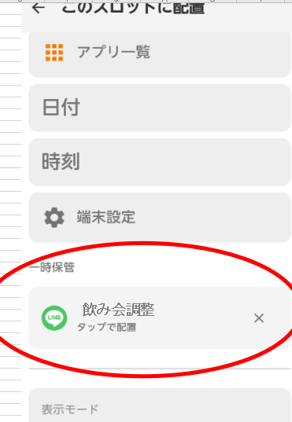

### アプリ一覧の呼び出し

ホーム画面を下から上にスワイプすると、「アプリ一覧」といラベルが現れ、その状態で指を離すと、アプリ一覧画面を開けます。ショートカットとして配置していないアプリもここから起動できます。

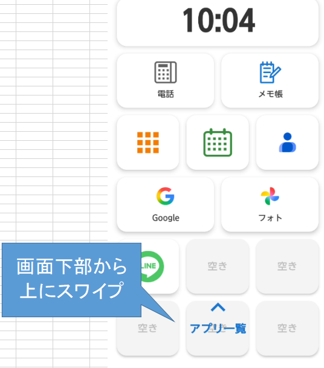

尚、アプリ一覧は、編集モードでスロットをタップした後の画面で、アプリ内機能からショートカットボタンとしても配置できます。

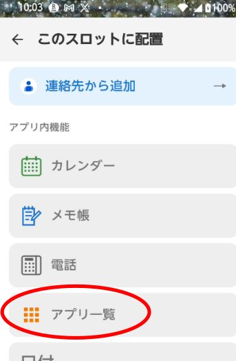

### アイコンの表示/非表示の切り替え

各ショートカットは、アイコン付き表示と文字だけの表示を切り替えられます。文字だけの表示にすると、よりシンプルな見た目になります。

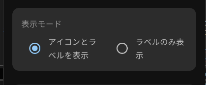
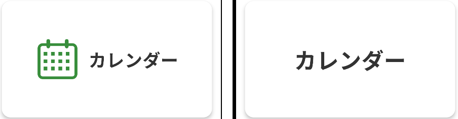

### スロット背景と文字色の変更（プレミアム機能）

スロットの背景と文字の色を変える事ができます。重要なショートカットを目立たせたり、カテゴリごとに色分けできます。
赤丸がついている色が現在選択されている色です。

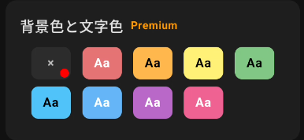

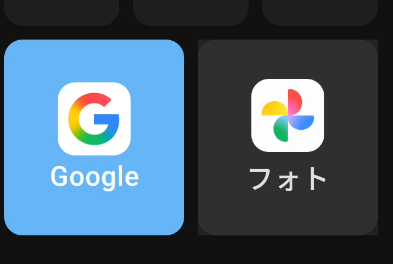

---

## 内蔵機能

### カレンダー

祝日表示付きのシンプルなカレンダーです。

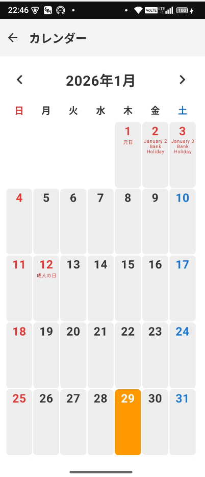

### メモ帳

大きな文字で簡単にメモを残せます。データは端末内のみに保存され、外部に送信されることはありません。
- チェックボックス付き
- 全選択・一括削除
- 1件あたり最大200文字、最大100件まで保存可能

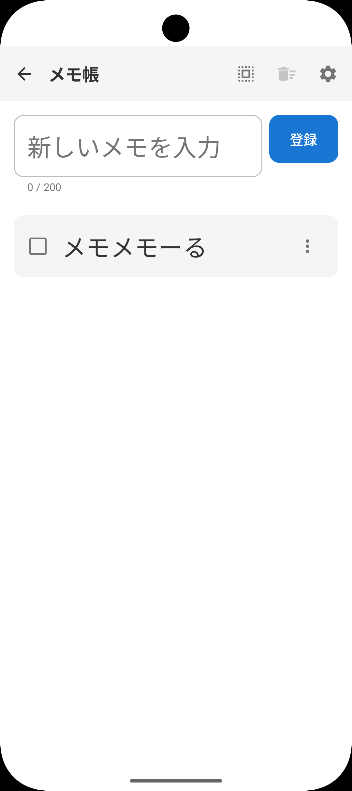
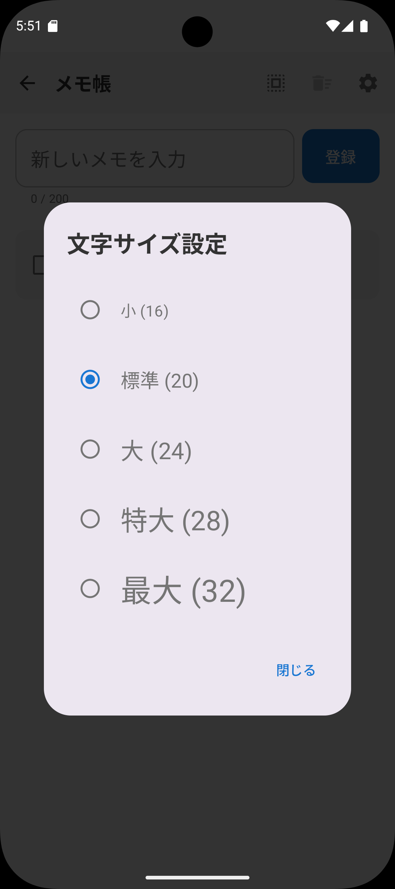

---

## アプリ設定

画面上部の「アプリ設定」から以下の設定を変更できます。

### ダークモード
ダークモード・ライトモード・端末設定に合わせる、を切り替えられます。

### 確認ダイアログ
ショートカットをタップした際に、起動前に確認ダイアログを表示できます。誤タップによる意図せぬアプリ起動を低減したい場合に有効にしてください。

### 振動の強さ

タップした時のフィードバックバイブレーションの強度を、OFF・弱・中・強に切り替えられます。
（端末自体のバイブレーション機能の有無やON/OFF状態にご注意ください。）

### ページの追加（プレミアム機能）
ホーム画面を最大5ページまで増やせます。ページはスワイプで切り替えできます。オプションでホーム画面のループスクロールするかどうかを切り替えられます。

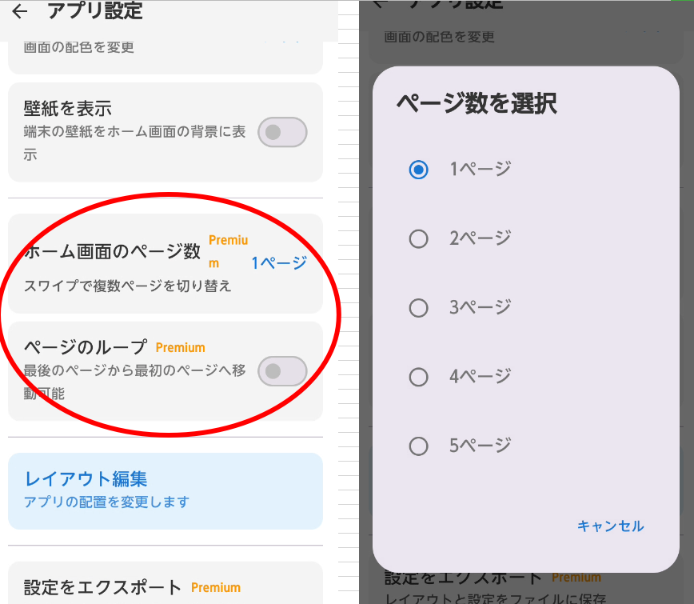

また、行を追加しようとして行数の上限に達した場合も、ページ追加の確認ダイアログが表示されます。

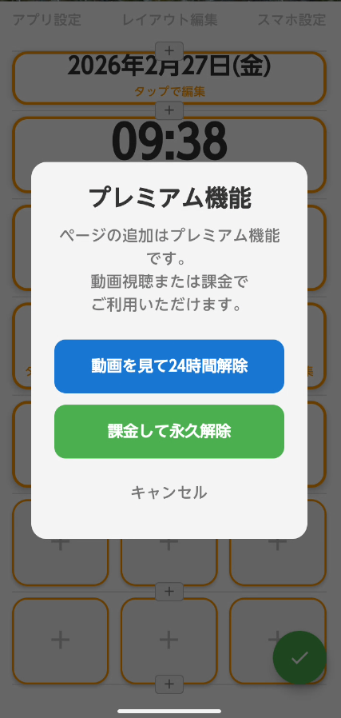

### バックアップ・復元（プレミアム機能）
ホーム画面のレイアウトやメモのデータをファイルに書き出し（エクスポート）、別の端末や初期化後に読み込み（インポート）できます。

---

## プレミアム機能

プレミアム機能のまとめです。動画広告の視聴（24時間限定）または課金（永久解除）でご利用いただけます。

| 機能 | 説明 |
|------|------|
| [スロットの色変更](#スロット背景と文字色の変更プレミアム機能) | ショートカットの背景色・文字色を個別に変更 |
| [ページの追加](#ページの追加プレミアム機能) | ホーム画面を最大5ページまで追加 |
| [バックアップ・復元](#バックアップ・復元プレミアム機能) | レイアウトやメモのデータをエクスポート・インポート |

---

## ダウンロード 

Google Play で配信中です。

---

## リンク

- [利用規約](TERMS_OF_SERVICE)
- [プライバシーポリシー](PRIVACY_POLICY)
